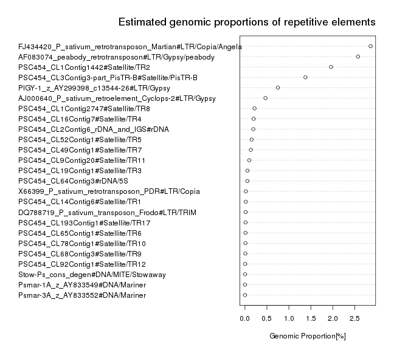
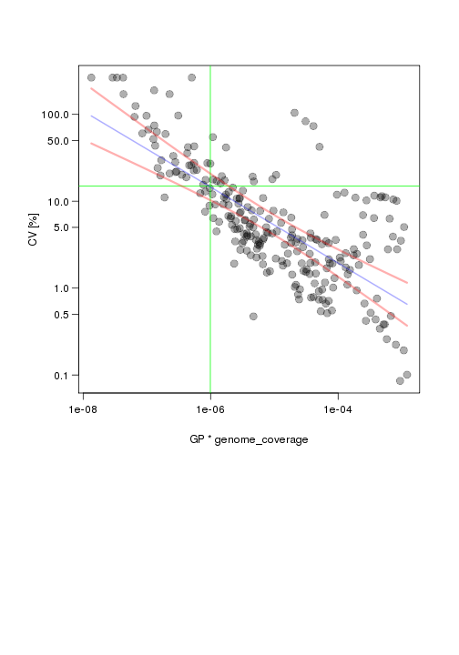

Here we try to evaluate what is the effect of genome coverage on reproducibility of repeat estimation with RepeatExplorer pipeline. We have used shotgun sequencing data from *P.sativum* genome and performed clustering on randomly sampled reads with different genome coverage. For annotation we have picked several previously well characterized repetitive elements. Abundance of selected repeats ranges between 0.001-3% of the genome. Best estimates of genomic proportions of used repetitive elements in *P.sativum* genome are shown below.

  
Clustering was performed with varying number of input reads (Sample size). Sample sizes were in the range from 10,000 to 2,000,000. Illumina reads with length 100 nt were used. Considering genome size of *P.sativum* 4,300 Mb/1C , the used range corresponds to genome coverage from 0.023% to 4.65%. Each coverage was analyzed with six replicates. Clusters were annotated based on the similarity to selected repeats and total genomic proportion was calculated for each repeat. Coefficient of variation (CV) was calculated for each coverage from replicates. In general, low coverage lead to underestimation of genomic proportions of repetitive elements. Additionally, decreasing the coverage leads to significantly higher variability of genomic proportion estimates. The variability of estimates is different in different repeats. This is probably related to monomer size and variability of repetitive element. The effect of genomic coverage on estimated genomic proportion and variability of estimate for selected repeats is shown on figures below.

All GP estimates for all tested repeats are summarized in scatter plot below. It shows a relation between coefficients of variance, genomic proportion of repeat (GP) and used genome coverage. Coefficient of variance is proportional to genome coverage multiplied by GP of repetitive element. This means, not surprisingly, that higher genome coverage have to be used to estimate abundance of repeat with lower GP. For example, if we want to keep CV of estimate below 15% and we want to estimate all repeats which have GP at least 0.01% we will need genome coverage to be at least ~ 1%. This case is shown by green lines on figure below. Be aware that the numbers shown are only approximate and are specific for *P. sativum* genome and Illumina 100 nt sequences. Other genomes will likely exhibit different characteristic affected mainly by repetitiveness and size of the genome and average sequence read length.

