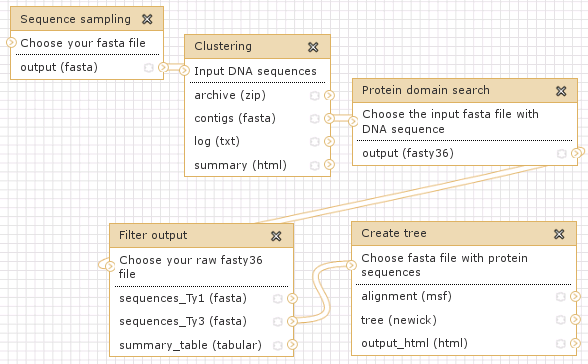
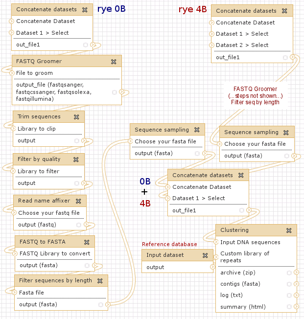
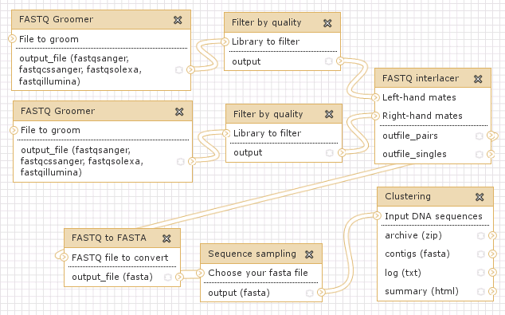
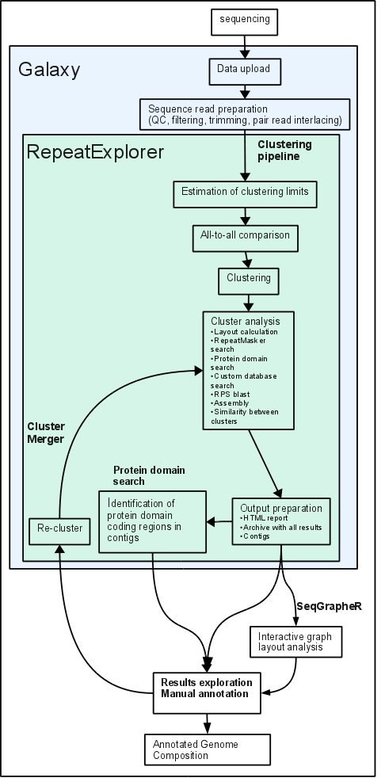

This manual was written for original version of RepeatExplorer, manuall for RepeatExplorer2 can be found in this [wiki](https://github.com/kavonrtep/repex_tarean)

## 1 Introduction
*RepeatExplorer* is a computational pipeline for discovery and characterization of repetitive sequences in eukaryotic genomes. The pipeline uses high-throughput genome sequencing data as an input and performs graph-based clustering analysis of sequence read similarities to identify repetitive elements within analyzed samples. The analysis principles were described in [Novak et al. (2010)](https://www.biomedcentral.com/1471-2105/11/378) and examples of its application can be found in a number of published papers (see Appendix). It should be noted that although the repeat identification algorithm generally works for any genome, some parts of the pipeline (e.g. protein domain-based classification of mobile elements) were primarily developed for application to plant genomics. However, there is a possibility to supply a custom repeat database to improve sensitivity in classification of non-plant repeats.

A public web server running *RepeatExplorer* is accessible at [`https://www.repeatexplorer.org`](https://www.repeatexplorer.org). The server uses only a small computer cluster for data analysis, therefore there are some restrictions imposed on its users in terms of available RAM, disc space and number of jobs run in parallel. The server can be used without registration, but it is recommended to set up a free account allowing the use of advanced features like data and workflow sharing. Users requiring more computational resources can set up their own instance of *RepeatExplorer* using its freely available source code. Consult installation instructions provided in Appendix.

An interface to *RepeatExplorer* was implemented within Galaxy platform ([`https://galaxy.psu.edu/`](https://galaxy.psu.edu/)) and takes advantage of various tools provided in this environment. Only the tools directly needed to upload and process sequences for RepeatExplorer are covered in this manual. In other cases, please refer to the [Galaxy wiki and help pages](https://wiki.g2.bx.psu.edu/). Attention should be payed to principles of data sharing and the use of workflows, as these features are used to provide data samples and analysis templates related to the examples given below (Chapter 3). An overview of the *RepeatExplorer* tools and links between them is schematically represented in Appendix.

Please include the following citations to your publications when presenting results obtained using *RepeatExplorer*:

*Principle of clustering analysis:* Novak, P., Neumann, P., Macas, J. (2010) – [Graph-based clustering and characterization of repetitive sequences in next-generation sequencing data](https://www.biomedcentral.com/1471-2105/11/378). BMC Bioinformatics 11: 378.

*RepeatExplorer*: Novak, P., Neumann, P., Pech, J., Steinhaisl, J., Macas, J. (2013) – [RepeatExplorer: a Galaxy-based web server for genome-wide characterization of eukaryotic repetitive elements from next generation sequence reads](https://bioinformatics.oxfordjournals.org/content/early/2013/02/20/bioinformatics.btt054). Bioinformatics

To provide feedback or report a problem please send email to server administrator: admin&lt;at&gt;repeatexplorer.org

## 2 Basic steps
### 2.1 Getting your data to/from the server
#### 2.1.1 Direct upload/Download
This option is suitable for small files (&lt; 500 MB) only. In the left panel (**Tools**) select: **Get Data –&gt; Upload File**

Datasets can be downloaded from dataset menu using diskette icon. In case you encounter connection problems use ftp download described below.

#### 2.1.2 Using FTP
Large datasets and/or multiple files should be uploaded via FTP employing *FTP over explicit TLS/SSL* protocol. We recommend using [FileZilla](https://filezilla-project.org/) FTP client with host name set to *repeatexplorer.umbr.cas.cz* and server type set to *FTPES*. To logon, use your *RepeatExplorer* account username and password. Alternatively, a command line tool *curl* can be used:

    curl -T my_file -k -v --ftp-ssl -u user:passwd ftp://repeatexplorer.umbr.cas.cz

Following the transfer, the files will appear in the **Files uploaded via FTP** list within **Tools –&gt; Get Data –&gt; Upload File**. Select the files you wish to import and click on “Execute” button. Once imported, the files will be removed from the list.

Please note that FTP can also be used to transfer output data from your analysis to your local computer. To do so, use **Tools –&gt; Repeat Explorer –&gt; EXPERIMENTAL TOOLS –&gt; Transfer data to ftp server** utility which will copy the selected file to your FTP directory on the server. This tool also generate some information about file like file size and md5sum. Upon completion, login to your *RepeatExplorer* account using FTP client and download the file to your computer. This option is highly recommended for downloading all large output files, because their download via web browser can take a long time and download through webserver cannot be resumed. Please note that the tool is currently suitable for downloading single files only (e.g. compressed archives of clustering results). Alternatively, download file from ftp server use curl command which enable resume of download. To ensure that file was transferred correctly, check md5sum. Example of curl ftp download with resume:

    curl -C - -o my_file.zip -k -v --ftp-ssl 
    -u user:passwd ftp://repeatexplorer.umbr.cas.cz/my_file.zip

#### 2.1.3 Downloading sequences from EBI SRA
Publically available datasets can be downloaded directly from the EBI Short Read Archive using **Get Data –&gt; EBI SRA** tool. Enter the ENA accession number in the search window, locate the corresponding dataset and select download link in the “Galaxy” column.

### 2.2 Pre-processing of sequence reads
The clustering analysis requires a single file containing read sequences in FASTA format as an input. If such a file can be uploaded by the user, no pre-processing is required. However, data obtained from sequencing facilities or downloaded from public archives are usually in FASTQ format combining nucelotide sequence information with sequencing quality scores. There is a number of programs for analyzing and pre-processing raw sequence reads in **Tools –&gt; NGS: QC and manipulation**. Some additional tools are provided in **Tools –&gt; Repeat Explorer –&gt; Utilities**. Tools recommended for pre-processing FASTQ data are listed below (help on using these tools is provided below their input forms):

-   **Tools –&gt; NGS: QC and manipulation –&gt; (ILLUMINA FASTQ) FASTQ Groomer** : Groomer has to be run first in order to use any other tool for FASTQ manipulation. Take care to select correct *FASTQ quality scores type*.
-   **Tools –&gt; NGS: QC and manipulation –&gt; (FASTX-TOOLKIT FOR FASTQ DATA) Filter by quality** : This filter can be optionally used to discard low-quality reads. Use **Compute quality statistics**, **Draw quality score boxplot** and **Draw nucleotides distribution chart** from the same toolbox to assess the quality of your data.
-   **Tools –&gt; Repeat Explorer –&gt; (UTILITIES) Read name affixer** : A tool to manipulate read names by adding prefix and/or suffix codes and remove spaces.
-   **Tools –&gt; NGS: QC and manipulation –&gt; (GENERIC FASTQ MANIPULATION) FASTQ to FASTA converter** : As a final step it converts reads to FASTA format.
-   **Tools –&gt; Repeat Explorer –&gt; (UTILITIES) Rename Sequences** : Replaces read names in FASTA files with numbers; it is possible to keep first characters of the original name (“Prefix length”) in cases of read names containing species codes.

#### 2.2.0.1 Examples of input formats
-   simple clustering – any plain fasta format is suitable:

             >1
             acgacagctgactaatgc
             >2
             cttcgaggctacacgagct
             >3
             actatcgacactgccggcgcg
             ...

-   comparative analysis of AB and XY genomes, sequence identifier must code genome type:

            >AB1
            acgacagctgactaatgc
            >AB2
            cttcgaggctacacgagct
            >AB3
            actatcgacactgccggcgcg
            ...
            >XY1
            gccccgtcgccgtccgtgtcg
            >XY2
            tgtgtgcccgtctgcgcgccccc
            >XY3
            atatgctatgcgcgc
            ...

-   pair-end reads – last character codes pair:

            >1f
            acgacagctgactaatgc
            >1r
            cttcgaggctacacgagct
            >2f
            actatcgacactgccggcgcg
            >2r
            gccccgtcgccgtccgtgtcg
            >3f
            tgtgtgcccgtctgcgcgccccc
            >3r
            atatgctatgcgcgc
            ...

-   comparative analysis with pair-end reads:

            >AB1f
            acgacagctgactaatgc
            >AB1r
            cttcgaggctacacgagct
            >AB2f
            actatcgacactgccggcgcg
            >AB2r
            gccccgtcgccgtccgtgtcg
            >XY3f
            tgtgtgcccgtctgcgcgccccc
            >XY3r
            atatcgtcgtgctatgcgcgc
            >XY4f
            tggggcctgtgcccgtctgcgcgccccc
            >XY4r
            atatgctatgcgcgc
            ...

### 2.3 Clustering analysis
The analysis can be run from **Tools –&gt; Repeat Explorer –&gt; Clustering**. It should be noted that due to its computational complexity the clustering procedure can take several days to finish, depending on the number of reads and repeat composition of analyzed samples. In extreme cases of genomes rich in certain types of repeats (e.g., satellite DNA), running time can be up to two weeks, whereas repeat-poor and small datasets are analyzed in several hours. To avoid exhausting available memory, repeat complexity of analyzed data is estimated before performing full-scale analysis using a small, randomly sampled subset of reads. If necessary, the number of reads in the dataset is then automatically reduced by random sampling (see analysis log file for information about eventual reduction of the dataset). However, **it is still recommended to perform a test run with a small subset (e.g. 100,000) of reads before running any large-scale analysis.**

#### 2.3.1 Parameters
Repeat identification using graph-based read clustering is a multi-step procedure that starts with an all-to-all sequence comparison in order to find pairs of reads with similarity that satisfy a specified threshold. This threshold is explicitly set to 90% sequence similarity spanning at least 55% of the read length (in the case of reads differing in length it applies to the longer one). However, it can be modified by changing *Minimum overlap length for clustering* value (see below). There is a number of other adjustable parameters to be set based on your input data and analysis type:

-   *Input DNA sequences:* A file with sequence reads in FASTA format. It is usually generated from raw sequence reads using **Pre-processing tools**.
-   *All sequence reads are paired:* Check this option if you are using paired-end or mate-pair reads. In that case it is crucial that the input file contains only complete read pairs and that both sequences from a pair are listed in succession. Use **RepeaExplorer –&gt; Utilities –&gt; FASTA interlacer** to achieve this arrangement. Please avoid using FASTQ interlacer located in NGS:QC and manipulation. This tools has high memory requiremtns and is suitable only when your paired sequences in two files are not in the same order.
-   *Rename sequences:* Sequences are renamed by default. If you want to keep the original sequence names (not recommended), uncheck this option. However, in the case of using original names of paired-end reads it is required that the left and right mates are distinguished by the last character of the read name. It is also necessary that there are only complete pairs and left mates alternate with their right mates.
-   *Length of sample code:* Number of characters (1-10) from the beginning of read names that will be used to distinguish reads from different samples. If *Rename sequences* option is checked, this part of the read names will be preserved. This option is useful only for comparative analysis of multiple samples (should be set to “0” in other cases). Sample code can be added to read names during their pre-processing using **Tools –&gt; Repeat Explorer –&gt; Read name affixer**.
-   *Minimum overlap length for clustering:* Minimal length (in nucleotides) of similarity hits to be considered significant. It can be used to *increase* the default threshold which requires similarity over at least 55% of the read length. This option affects clustering but not assembly.
-   *Cluster size threshold for detailed analysis:* Directories gathering various types of data and outputs from additional analyzes are generated for a certain number of the largest clusters (see Description of the output files). The minimum size of clusters to be selected is defined as a proportion of the number of all analyzed reads (e.g., employing a default value of 0.01% with a dataset of 1,000,000 reads, all clusters containing at least 100 reads will be included). Setting this parameter below 0.01% is not recommended as it would lead to analyzing large numbers (&gt;300) of clusters which is time consuming.
-   *RepeatMasker database:* RepeatMasker is run against read sequences within individual clusters to provide information for their annotation. If possible, select one of the libraries specific for a group of organisms instead of searching a complete database (option “All”). It is also possible to completly omit RepeatMasker search against RepBase and use custom database insted.
-   *Use custom repeat database:* This option can be used to aid in repeat classification within clusters and is recommended especially for species which are under-represented in the RepeatMasker databases. The database should be a single file containing DNA sequences in FASTA format. There should be information about repeat type/family encoded within FASTA header line of each sequence, in the same format as used for RepeatMasker libraries (e.g., &gt;sequence\_id\#Copia/Angela). The custom library should be uploaded to the server using **Get Data –&gt; Upload File** tool.
-   *Search conserved domain database:* Runs RPS-BLAST search of read sequences against a database of conserved protein domains. This analysis is time consuming, taking ~ 8 hours to process 1 million reads on the current system.
-   *Minimal overlap for assembly:* This option corresponds to the `"-o"` parameter of the cap3 program which is used for read assembly within the clusters. Default value of 40 can be increased for reads longer than 100 nt.

#### 2.3.2 Description of the output files
Execution of the clustering analysis results in the generation of four new entries in the **History** panel. Two of them, *Log file* and *Contigs* consist of single plain text files, whereas *HTML summary* and *Archive with clustering results* contain multiple folders and files that can be downloaded as zip archives. The content of the *HTML summary* output can also be directly viewed using “Display data in browser” option (an eye symbol). Below is a description of the most important files within output data.

##### 2.3.2.1 Log file
The file lists analysis parameters and gathers various messages generated during the pipeline run. It is being updated during the run, thus it can be viewed to monitor analysis progress.

##### 2.3.2.2 HTML summary
This archive contains an overview of clustering results. It can be inspected either directly from the Galaxy menu, or after downloading and unpacking the archive by opening the file `HTML_summary_of_graph_based_clustering...html` (within `HTML_summary...` directory). There is a histogram showing sizes and cumulative proportions of the clusters, total proportions of clustered reads and singlets. Below, there is a table that lists various information for the largest clusters. Further details can be viewed for each cluster by following the link *CLnumber*.

##### 2.3.2.3 Archive with clustering results
Upon downloading and unpacking the archive there will be a top directory (`seqClust`) generated, containing all the files. Below, we refer to each file by its path related to the `seqClust` directory:

-   `/seqClust/sequences/`: directory storing sequence reads which were used as input for the clustering analysis
    -   `seqClust`: mutli-fasta file with all sequence reads (in the case when user-provided set of reads was sampled, only the reads actually used for analysis are included here)
    -   `index.tab`: if the reads were renamed, their original and new ids are stored in this file
    -   `seqClust.nhr, seqClust.nin, seqClust.nsq`: blast database files
    -   `seqClust.cidx`: index file used by `cdbyank` program (part of the TGICL package)
-   `/seqClust/clustering/`: main directory for storing clustering results
    -   `hitsort_PID90_LCOV55.cls`: assignment of reads into clusters; for each cluster, there is a fasta-like header line with cluster number and size (number of reads), followed by a line containing ids of all reads assigned to the cluster. For example:

            >CL1 5
            id_1 id_2 id_3 id_4 id_5
            >CL2 3
            id_6 id_7 id_8
            etc....

    -   `hitsort_PID90_LCOV55`: pairs of reads with significant similarity (lists all pairs with similarity &gt;=90% covering &gt;=55% of the length of the longer read and blast bit score of the hit)

    -   `graph_layouts.pdf`: graph layouts and statistics for the largest clusters
-   `/seqClust/clustering/blastx/`: results of blastx similarity search of reads from individual clusters against the database of plant transposable element protein domains
-   `/seqClust/clustering/clusters/dir_CLnumber/`: directories storing detailed information for the largest clusters (minimal size of clusters to be listed here is defined by the *Cluster size threshold for detailed analysis* option)
    -   `reads.ids, reads.fas`: ids and fasta sequences, respectively, of the reads assigned to the cluster
    -   `contigs.CLnumber`: all contigs assembled for the cluster
    -   `contigs.CLnumber.minRD5`: contigs with average read depth &gt;= 5 sorted by the read depth (`_sort-GR` sorted according to genome representation; `_sort-length` sorted according to contig length)
    -   `contigs.CLnumber.prof.pdf`: read depth profiles of contigs
    -   `ACE_CLnumber.ace`: cap3 assembly file (can be viewed e.g. using `clview` program)
    -   `CLnumber.GL`: graph layout (to be viewed using `SeqGrapher` program avalable from [`https://cran.r-project.org/web/packages/SeqGrapheR/index.html`](https://cran.r-project.org/web/packages/SeqGrapheR/index.html))
    -   `CLnumber_blastx.csv`: blastx hits of reads to database of plant transposable element protein domains
    -   `CLnumber_domains.csv`: summary table of blastx hits listed in `CLnumber_blastx.csv`
-   `/seqClust/assembly/`: output files from the assembly of reads within the clusters
    -   `contigs`: all contigs in fasta format (contig names are derived from their cluster of origin)

    -   `contigs.info`: all contigs with additional information about their length, average read depth and genome representation (read depth x length) encoded in the fasta header line:

            >CLxContigY (length[bp]-read_depth-genome_representation)

    -   `contigs.info.minRD5`:contigs with average read depth &gt;= 5 sorted according to read depth (`_sort-GR` sorted according to genome representation; `_sort-length` sorted according to contig length)

### 2.4 Re-clustering
Since the clustering algorithm frequently splits large or variable repetitive elements into multiple clusters, it may be desirable to merge these clusters for subsequent analysis. To do so, use **Tools –&gt; Repeat Explorer –&gt; Cluster merger**. Upload a plain text file with lists of cluster numbers to be merged on separate lines, e.g.:

    1 6 15 89
    3 56 102
    etc...

Select the previously calculated *Archive with clustering analysis* to be re-clustered. The clusters from this archive listed on each line will be merged (e.g. 1 + 6 + 15 + 89 will make a new cluster) and their graph layouts and other characteristics will be re-calculated. The remaining clusters from the previous analysis will remain the same but their numbering will probably change (clusters will be re-numbered based on their size).

### 2.5 Identification and analysis of LTR-retroelement protein domains
This analysis is aimed at extraction and phylogenetic analysis of conserved regions of LTR-retroelement protein domains from a set of input nucleotide sequences. It has been designed for analyzing contig sequences obtained from the clustering analysis; however, it can be applied to any multi-fasta file of DNA sequences provided they do not contain multiple domains of the same type. The analysis consists of three consecutive steps:

-   **Tools –&gt; Repeat Explorer –&gt; (PROTEIN DOMAINS TOOLS) Protein domain search** : Analyzed sequences are scanned for similarity to a comprehensive database of plant retroelement protein domains (either of GAG, PROT, RT, RH, INT, CHDCR chromodomain or CHDII chromodomain can be selected). The search is perfomed using fasty36 \[LINK !\] program with default parameters which are relatively relaxed (`-E 10`).
-   **Tools –&gt; Repeat Explorer –&gt; (PROTEIN DOMAINS TOOLS) Filter output** : Output from the previous step is filtered using user-specified stringency parameters, resulting in a multi-fasta file of identified protein domain sequences supplemented with a set of sequences from the reference database that generated the best similarity hits. The reference sequences have information that defines the type and phylogenetic clade of the element (separate files are generated for Ty1/copia and Ty3/gypsy elements). The files can be downloaded or further processed using **Create tree** tool.
-   **Tools –&gt; Repeat Explorer –&gt; (PROTEIN DOMAINS TOOLS) Create tree** : Runs multiple sequence alignment using Muscle program and calculates phylogenetic tree using the neighbor-joining method. The resulting alignment can be downloaded along with the tree in Newick format and HTML output including tree image.

## 3 Examples of analysis workflows
The following examples were designed to illustrate the most frequent applications of *RepeatExplorer* and to practically demonstrate its various tools and data types. Although the examples use real sequence data as an input, these datasets were reduced in size for the sake of analysis speed, therefore providing lower sensitivity in repeat detection compared to analyzing larger volumes of sequence data. In addition, some aspects of downstream analyzes are covered only briefly and should be treated more thoroughly when performing real analysis.

The examples are available via Galaxy menu *Shared Data –&gt; Published Histories*, or directly using the links provided below. Each example history provides a record of finished analysis, including input data, output of individual analysis steps and parameters used to run the tools. **Please read the annotations of individual steps in histories as they provide an explanation for the workflow**. The workflows extracted from the example histories are also available (to import workflow to your account go to “Shared data -&gt; Published workflows” in the Galaxy menu, select workflow from a list and then “Import workflow”). After importing, select “Edit” workflow in order to view its structure and eventually modify some parameters to suit your data. Alternatively, histories can also be imported to user accounts and used to extract workflows (*History –&gt; Extract Workflow*) for repeated use with different input data. Input data used for all examples are provided as a separate history (“Input data for example histories”). Original raw sequencing data used for the examples are from whole genome shotgun sequencing of rye (*Secale cereale*) plants containing or lacking supernumerary B chromosomes (EBI SRA study [ERP001061](https://www.ebi.ac.uk/ena/data/view/ERP001061); Martis et al. 2012), and from pea (*Pisum sativum*) genome (SRA study [ERP001104](https://www.ebi.ac.uk/ena/data/view/ERP001104); Neumann et al. 2012).

### 3.1 Example history \#1: Clustering analysis of a small sample dataset of 454 reads followed by identification and phylogenetic analysis of retrotransposon RT domains in assembled contigs
A simple example that includs a random sampling of 200,000 sequences from FASTA formatted set of 454 reads and subsequent clustering analysis. The dataset was prepared from sequencing rye plants containing B chromosomes.

Link: [`https://www.repeatexplorer.org/u/jirka/h/example-history-1-1`](https://www.repeatexplorer.org/u/jirka/h/example-history-1-1)   
Workflow representing Example history \#1

### 3.2 Example history \#2: Comparative analysis of repeats between two genomes
The example demonstrates the processing of raw 454 sequence data downloaded in FASTQ format from a public repository, random sampling of reads from several sequencing runs in order to obtain a more representative dataset and various read manipulations (quality filtering, trimming to the same length). Two samples representing genome variants of rye (Secale cereale) differing in the presence (4B) or absence (0B) of supernumerary B chromosomes are processed in parallel and subsequently used for comparative analysis of their repeat composition.

Link: [`https://www.repeatexplorer.org/u/jirka/h/example-history-2`](https://www.repeatexplorer.org/u/jirka/h/example-history-2)   
Workflow representing Example history \#2

### 3.3 Example history \#3: Clustering analysis using paired-end Illumina reads
The history shows utilization of paired-end reads for repeat characterization in the genome of garden pea (*Pisum sativum*). Datasets containing forward and reverse reads are processed separately, then combined and used for the clustering analysis.

Link: [`https://www.repeatexplorer.org/u/jirka/h/example-history-3`](https://www.repeatexplorer.org/u/jirka/h/example-history-3)   
Workflow representing Example history \#3

## 4 Command line version
Clustering can be also performed without Galaxy platform using command line version of the pipeline. Installation of command line version is described in Apendix. RepeatExplorer is also vailable on Czech National Grid Infrastructure (see [www.metacentrum.cz](https://www.metacentrum.cz) ). To use RepeatExplorer command line version in metacentrum type:

    module add repeatexplorer
    seqclust_cmd.py -h

When you use seqclust\_cmd.py on matacentrum PBS cluster, be carefull about resources requirements. Reserve at least 8 cpu with 16gb of RAM and select ‘long queue’ – job usually needs several days to finish ( qsub -l:nodes=1:ppn=8:mem=16gb -q long). It is likely that the real need of RAM will be bigger than specified as the read memory requiremnt are hard to predict. In metacentrum, jobs which use more resources than what was requested upon submission can be authomatically terminated. To avoid termination of running jobs, it is good idea to reserve 32 GB in qsub command but specify only 16 GB in seqclust-cmd.py.

    Usage: seqclust_cmd.py [options]

    Options:
      -h, --help            show this help message and exit
      -s SEQS, --sequences=SEQS
                            input sequences in fasta format
      -m MINCL, --mincl=MINCL
                            minimal size of cluster for detailed analysis
                            [% of total reads]
      -o MINOVL, --minovl=MINOVL
                            minimal overlap for assembly
      -d REPEATMASKER, --repeatmasker=REPEATMASKER
                            repeatmasker database, possible options are All,
                            Viridiplantae, Metazoa, Mammalia, Fungi, None
      -v OUTPUT_DIR, --output_dir=OUTPUT_DIR
                            Output directory
      -p, --paired          pair reads
      -a, --sq_rename       do not rename sequences
      -l OVERLAP, --overlap=OVERLAP
                            minimal overlap(default 55, 30-500)
      -k CUSTOM_DATABASE, --custom_database=CUSTOM_DATABASE
                            file with custom repeat masker database
      -e RPS_BLAST, --rps_blast=RPS_BLAST
                            if you want to run rpsblast against CDD specify 
                            e value (1e-2 - 1e-10)
      -f PREFIX, --prefix=PREFIX
                            prefix length - for comparative analysis
      -z SEQCLUST_DIR, --seqclust_dir=SEQCLUST_DIR
                            directory which contain previous clustering results
                            with seqclust directory, this directory must be
                            different from output directory
      -b MERGE, --merge=MERGE
                            file with lists of clusters for merging
      -r MAX_MEM, --max_mem=MAX_MEM
                            Maximal amount of available RAM in kB if not set,
                            clustering tries to use whole available RAM
      -c CPU, --cpu=CPU     number of cpu to use, by default all available
                            processors are used

    EXAMPLES:

    clustering with default:
        seqclust_cmd.py -s sequences.fas -v output_directory
    clustering with comparative analysis when specieas are coded by the first 4 characters in sequence names:   
        seqclust_cmd.py -s sequences.fas -f 4 -v output_directory
    clustering with pair illumina reads:
        seqclust_cmd.py -s sequences.fas -p -v output_directory

    merging of clusters from previous clustering:
        seqclust_cmd.py -z output_directory -b merge.txt -v output_directory2

## 5 Appendices
### 5.1 Links to web resources
Galaxy Wiki: [`https://wiki.g2.bx.psu.edu/`](https://wiki.g2.bx.psu.edu/)

FileZilla FTP client: [`https://filezilla-project.org/`](https://filezilla-project.org/)

### 5.2 List of papers using graph-based read clustering for repeat identification
(sorted chronologically)

Novak, P., Neumann, P., Macas, J. (2010) – [Graph-based clustering and characterization of repetitive sequences in next-generation sequencing data](https://www.biomedcentral.com/1471-2105/11/378). BMC Bioinformatics 11: 378.

Macas, J., Kejnovsky, E., Neumann, P., Novak, P., Koblizkova, A., Vyskot, B. (2011) – [Next generation sequencing-based analysis of repetitive DNA in the model dioecious plant Silene latifolia](https://www.plosone.org/article/info%3Adoi%2F10.1371%2Fjournal.pone.0027335). PLoS ONE 6: e27335.

Renny-Byfield, S., Chester, M., Kovarik, A., Le Comber, S.C., Grandbastien, M.A., Deloger, M., Nichols, R., Macas, J., Novak, P., Chase, M.W., Leitch, A.R. (2011) – Next generation sequencing reveals genome downsizing in allopolyploid Nicotiana tabacum, predominantly through the elimination of paternally derived repetitive DNAs. Mol. Biol. Evol. 28: 2843-2854.

Torres, G.A., Gong, Z., Iovene, M., Hirsch, C.D., Buell, C.R., Bryan, G.J., Novak, P., Macas, J., Jiang, J. (2011) – [Organization and evolution of subtelomeric satellite repeats in the potato genome](https://www.g3journal.org/content/1/2/85). G3: Genes, Genomes, Genetics 1: 85-92.

Pagan, H.J.T., Macas, J., Novak, P., McCulloch, E.S., Stevens, R.D., Ray, D.A. (2012) – [Survey sequencing reveals elevated DNA transposon activity, novel elements, and variation in repetitive landscapes among bats](https://gbe.oxfordjournals.org/content/4/4/575.full). Genome Biol. Evol., 4: 575-585.

Renny-Byfield, S., Kovarik, A., Chester, M., Nichols, R.A., Macas, J., Novak, P., Leitch, A.R. (2012) – [Independent, rapid and targeted loss of highly repetitive DNA in natural and synthetic allopolyploids of Nicotiana tabacum](https://www.plosone.org/article/info%3Adoi%2F10.1371%2Fjournal.pone.0036963). PLoS ONE 7: e36963.

Neumann, P., Navratilova, A., Schroeder-Reiter, E., Koblizkova, A., Steinbauerova, V., Chocholova, E., Novak, P., Wanner, G., Macas, J. (2012) – [Stretching the rules: monocentric chromosomes with multiple centromere domains](https://www.plosgenetics.org/article/info:doi/10.1371/journal.pgen.1002777). PLoS Genetics 8: e1002777.

Piednoel, M., Aberer, A.J., Schneeweiss, G.M., Macas, J., Novak, P., Gundlach, H., Temsch, E.M., Renner, S.S. (2012) – [Next-generation sequencing reveals the impact of repetitive DNA across phylogenetically closely related genomes of Orobanchaceae](http://w3lamc.umbr.cas.cz/lamc/publ/Pidnoel_MBE_2012.pdf). Mol. Biol. Evol. 29: 3601-3611.

Martis, M.M., Klemme, S., Moghaddam, A.M.B., Blattner, F.R., Macas, J., Schmutzer, T., Scholz, U., Gundlach, H., Wicker, T., Simkova, H., Novak, P., Neumann, P., Kubalakova, M., Bauer, E., Haseneyer, G., Fuchs, J., Dolezel, J., Stein, N., Mayer, K.F.X., Houben, A. (2012) – [Selfish supernumerary chromosome reveals its origin as a mosaic of host genome and organellar sequences](http://w3lamc.umbr.cas.cz/lamc/publ/Martis_PNAS_2012.pdf). Proc. Natl. Acad. Sci. USA 109: 13343-13346.

Gong, Z., Wu, Y., Koblizkova, A., Torres, G.A., Wang, K., Iovene, M., Neumann, P., Zhang, W., Novak, P., Buell, R., Macas, J., Jiang, J. (2012) – [Repeatless and repeat-based centromeres in potato: implications for centromere evolution](https://www.plantcell.org/cgi/content/short/tpc.112.100511?keytype=ref&ijkey=o65xnLSgzVjzoWv). Plant Cell, 24: 3559-3574.

Renny-Byfield, S., Kovarik, A., Chester, M., Nichols, R.A., Macas, J., Novak, P., Leitch, A.R. (2012) – [Independent, rapid and targeted loss of highly repetitive DNA in natural and synthetic allopolyploids of Nicotiana tabacum](https://www.plosone.org/article/info%3Adoi%2F10.1371%2Fjournal.pone.0036963). PLoS ONE 7: e36963.

Novak, P., Neumann, P., Pech, J., Steinhaisl, J., Macas, J. (2013) – [RepeatExplorer: a Galaxy-based web server for genome-wide characterization of eukaryotic repetitive elements from next generation sequence reads](http://w3lamc.umbr.cas.cz/lamc/publ/Novak_Bioinformatics_2013.pdf). Bioinformatics 29: 792-793.

Heckmann, S., Macas, J., Kumke, K., Fuchs, J., Schubert, V., Ma, L., Novak, P., Neumann, P., Taudien, S., Platzer, M., Houben, A. (2013) – [The holocentric species Luzula elegans shows interplay between centromere and large-scale genome organization](http://w3lamc.umbr.cas.cz/lamc/publ/Heckmann_Plant_J_2013.pdf). Plant J. 73: 555-565.

Renny-Byfield, S., Kovarik, A., Kelly, L., Macas, J., Novak, P., Chase, M., Nichols, R.A., Pancholi, M., Grandbastien, M.A., Leitch, A. (2013) – Diploidisation and genome size change in allopolyploids is associated with differential dynamics of low and high copy sequences. Plant J., in press.

Renny-Byfield, S., Kovarik, A., Kelly, L., Macas, J., Novak, P., Chase, M., Nichols, R.A., Pancholi, M., Grandbastien, M.A., Leitch, A. (2013) – [Diploidisation and genome size change in allopolyploids is associated with differential dynamics of low and high copy sequences](https://gbe.oxfordjournals.org/content/5/4/769.full). Plant J.,74: 829-839

Klemme, S., Banaei-Moghaddam, A.M., Macas, J., Wicker, T., Novak, P., Houben, A. (2013) – [High-copy sequences reveal a distinct evolution of the rye B chromosome](https://onlinelibrary.wiley.com/doi/10.1111/nph.12289/abstract). New Phytol.,199: 550-558.

Steflova, P., Tokan, V., Vogel, I., Lexa, M., Macas, J., Novak, P., Hobza, R., Vyskot, B., Kejnovsky, E. (2013) – [Contrasting patterns of transposable element and satellite distribution on sex chromosomes (XY1Y2) in the dioecious plant Rumex acetosa](https://gbe.oxfordjournals.org/content/5/4/769.full). Genome Biol. Evol. 5: 769-782.

### 5.3 Installation
#### 5.3.1 Dependencies
There is number of additional dependencies not provided by RepeatExplorer authors. Additional programs include:

-   **R programming environment** ([`https://www.r-project.org`](https://www.r-project.org)). Beside R core installation, additional library must be installed: foreach, igraph, getopt, R2HTML, lattice, doMC, multicore, ape and Biostrings (available from [`https://www.bioconductor.org`](https://www.bioconductor.org))
-   **Perl** programming language ([`https://www.perl.org/`](https://www.perl.org/)) with Bio::SeqIO module installed
-   **Python** ([`https://www.python.org`](https://www.python.org)) version 2.6.x
-   **ImageMagick** ([`https://www.imagemagick.org`](https://www.imagemagick.org))
-   **TGICL** TGICL is now provided with RepeatExplorer, see the directory tgicl\_linux.
-   **NCBI Basic Local Alignment Search Tool** version 2.2.xx, available from [`ftp://ftp.ncbi.nlm.nih.gov/blast/executables/release//`](ftp://ftp.ncbi.nlm.nih.gov/blast/executables/release//). version 2.2.21 was tested
-   **RepeatMasker** executables and database ([`https://www.repeatmasker.org`](https://www.repeatmasker.org)) must be installed together with cross\_match search engine [`https://www.phrap.org`](https://www.phrap.org). RepeatMasker is provided with only a minimal database of repeats. To enhance its functionality, **Repbase**, a database of repetitive DNA elements must be obtained from [`https://www.girinst.org/`](https://www.girinst.org/). (see Repbase Update(2005), a database of eukaryotic repetitive elements. Cytogentic and Genome Research 110:462-467 for detailes)
-   The European Molecular Biology Open Software Suite (**EMBOSS**) available from [`https://emboss.sourceforge.net`](https://emboss.sourceforge.net)
-   **Muscle** – Multiple sequence alignment program available from [`https://www.drive5.com/muscle/`](https://www.drive5.com/muscle/)
-   Graph based clustering is performed using the Louvain method. Original source code which is available from [`https://sites.google.com/site/findcommunities`](https://sites.google.com/site/findcommunities) was modified to make it suitable for RepeatExplorer. Source is located in `louvain` direcory must be compiled using make
-   **fasty36** [`https://faculty.virginia.edu/wrpearson/fasta/`](https://faculty.virginia.edu/wrpearson/fasta/)
-   **GNU parallel** is now provided with RepeatExplorer [`https://www.gnu.org/software/parallel/`](https://www.gnu.org/software/parallel/)
-   Conserve Domain Database (**CDD**) can be obtained from NCBI ftp site:[`ftp://ftp.ncbi.nih.gov/pub/mmdb/cdd/`](ftp://ftp.ncbi.nih.gov/pub/mmdb/cdd/)

#### 5.3.2 Adding RepeatExplorer to your local Galaxy installation
-   To obtain copy of RepeatExplorer from repository, run Mercurial commands:

        hg clone https://bitbucket.org/repeatexplorer/repeatexplorer
        cd repeatexplorer
        hg update -r stable

    Mercurial is a revision control tool for software development. If you do not have Mercurial installed, RepeatExplorer can be downloaded as a zip archive from [`https://github.com/kavonrtep/repex_tarean`](https://github.com/kavonrtep/repex_tarean).

-   From `repeatexplorer` directory copy directory `umbr_programs` to `$GALAXY_DIR/tools/`

-   Modify file `$GALAXY_DIR/tool_conf.xml` by adding content of file `repeatexplorer/tools.xml` into appropriate location. This will add RepeatExplorer tools to Galaxy tool menu. To understand the syntax of `tool_conf.xml`, consult Galaxy wiki ([`https://wiki.g2.bx.psu.edu/`](https://wiki.g2.bx.psu.edu/)).

-   add content of `repeatexplorer/tool-data` directory to `$GALAXY_DIR/tool-data` directory

The above steps can be also performed using script *install2galaxy.sh* executed from repeatexplorer directory:

    ./install2galaxy.sh -d $GALALXY_DIR

If using `install2galaxy.sh` script, we recommend to make a backup copy of *tool\_conf.xml*. Note that `install2galaxy.sh` script will place *RepeatExplorer* menu as the last item of installed *Galaxy* tools.

#### 5.3.3 Setting up correct paths
File `seqclust.config` located in `$GALAXY_DIR/tools/umbr_programs/seqclust/programs/` directory defines some environment variables necessary for RepeatExplorer functionality. It is possible to either set variables according to your local installation or adjust your program and databases locations to correspond to the default configuration setting. A second option will ease future RepeatExplorer updates. The configuration file defines following variable:

-   `$TGICL` location of TGICL program directory. Essential executable files,including mgblast and cap3, are located in `$TGCIL/bin`
-   `$PROG_COMMUNITY` location of Louvain clustering program directory (do not forget to compile executables!)
-   `$REPEAT_MASKER` RepeatMasker installation directory. This directory contain both executable and RepeatMasker database. RepeatMasker uses `cross_match` search engine. Note that the path to `cross_match` executable is hard coded in the file `$REPEAT_MASKER/RepeatMaskerConfig.pm`. To set correct path to `cross_match`, modify `CROSSMATCH_DIR` and `CROSSMATCH_PRGM` variables in `RepeatMaskerConfig.pm` script or use configuration script which is provided with RepeatMasker.
-   `$RPSBLAST_DATBASE` and `$RPSBLAST_DATBASE_ANNOTATION` location of CDD database files

Additional variables in `seqclust.config`:

-   `$MAXEDGES` can limit the maximal size of the data set which could be processed. Normally, this limit is set based on the available computer RAM. If the gathering information about memory size fails, then the `$MAXEDGES` variable is used instead. By default `$MAXEDGES` is set to 350000000 which is suitable for computer with 16 GB of RAM.
-   variables `$MAXEDGES_FOR_LAYOUT` and `$MAXNODES_FOR_LAYOUT` limit the maximal size of graph for which the layout is calculated. If number of sequences or similarity hits in cluster exceed `$MAXNODES_FOR_LAYOUT` or `$MAXEDGES_FOR_LAYOUT` respectively, sample of cluster is created and used for layout calculation. The increasing these parameters can significantly affect computation time.

#### 5.3.4 Updates
If *RepeatExplorer* was obtained using *Mercurial*, then running commands from repeatexplorer folder will update installation

    hg pull
    hg update
    ./install2galaxy.sh -d $GALAXY_DIR

alternatively, download files manually from repository, unpack and install with `/install2galaxy.sh -d $GALAXY_DIR` command

#### 5.3.5 Command line version
Command line version of clustering and merging is provided. See the README.txt for installation intructions

### 5.4 RepeatExplorer performance
Currently, the clustering step uses the Louvain method. While this method outperforms the previously used method , in terms of computational time, it still requires that the whole graph is loaded into memory. Memory usage is directly proportional to the total number of similarity hits. The number of similarity hits *E* can be calculated from:

> *E = N(N-1)k*

Where *N* is the total number of reads and *k* is a coefficient which depends on the repetitivenes of the genome. Less reads can be used for highly repetitive genomes and conversely, less repetitive genomes will allow one to use more sequencing data. Based on the previously analyzed data from *P. sativum*, it is possible to cluster up to 4 million 100 nt long reads on the computer with 16GB of RAM. At this setting, the whole clustering and subsequent analysis needs approximately 8 days to finish. With the amount 500 thousand sequence reads which, is still sufficient for a repeat survey,the calculation finishes in about 6 hrs. Also note that there is a considerable amount of data generated. For example, clustering of 4 million *P.sativum* reads yields 50GiB of uncompressed files. To prevent the exhausting of the available memory, each clustering run is preceded by testing to estimate the limit for the number of reads. If the total number of sequences exceeds the limit, only a fraction of reads is used for clustering.A limit is set either based on the available memory or from `$MAXEDGES` parameter as described above.

To cut down computation time, some parts of RepeatExplorer were parallelized to take advantage of multicore processors. Namely, all to all sequence comparison with *mgablast*, protein domain search with rpsblast and blastx and graph layout calculation. This parallelization does not required any special setting except installation of *GNU parallel* and *R* packages *foreach*, *multicore* and *doMC*.

### 5.5 License
Copyright (c) 2012 Petr Novak (petr@umbr.cas.cz), Jiri Macas, Pavel Neumann

This program is free software: you can redistribute it and/or modify it under the terms of the GNU General Public License as published by the Free Software Foundation, either version 3 of the License, or (at your option) any later version.

This program is distributed in the hope that it will be useful, but WITHOUT ANY WARRANTY; without even the implied warranty of MERCHANTABILITY or FITNESS FOR A PARTICULAR PURPOSE. See the GNU General Public License for more details. You should have received a copy of the GNU General Public License along with this program. If not, see [`https://www.gnu.org/licenses/`](https://www.gnu.org/licenses/).

### 5.6 Schematic representation of the RepeatExplorer pipeline
  
Scheme of the clustering pipeline
